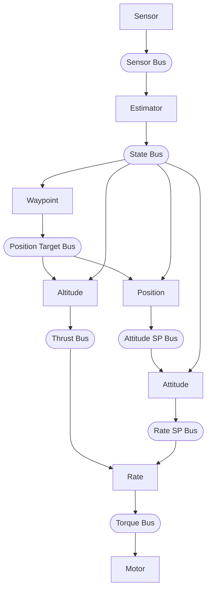

# Pilot Example

Quadcopter waypoint navigation using hive actor runtime.

Supports two platforms:
- **Webots simulation** (default) - Crazyflie quadcopter in Webots simulator
- **STM32 hardware** - STEVAL-DRONE01 mini drone kit (55 KB flash, 49 KB RAM)

## What it does

Demonstrates waypoint navigation with a quadcopter using 8 actors:

1. **Sensor actor** reads raw sensors via HAL, publishes to sensor bus
2. **Estimator actor** runs complementary filter, computes velocities, publishes to state bus
3. **Altitude actor** reads target altitude from position target bus, runs altitude PID
4. **Waypoint actor** manages waypoint list, publishes to position target bus
5. **Position actor** reads target XY/yaw from position target bus, runs position PD
6. **Attitude actor** runs attitude PIDs, publishes rate setpoints
7. **Rate actor** runs rate PIDs, publishes torque commands
8. **Motor actor** reads torque bus, writes to hardware via HAL (mixer is in HAL)

**Webots:** Flies a square pattern with altitude changes at each waypoint (full 3D navigation with GPS).

**STEVAL-DRONE01:** Hovers and changes altitude only (no GPS, so XY position fixed at origin).
Safety features enabled: 60-second startup delay, 5-second flight window, emergency cutoff
on excessive tilt (>45°), excessive altitude (>2m), or landing.

## Prerequisites

**For Webots simulation:**
- Webots installed (https://cyberbotics.com/)
- hive runtime built: `cd ../.. && make`

**For STM32 hardware:**
- ARM GCC: `apt install gcc-arm-none-eabi`
- ST-Link: `apt install stlink-tools`

## Build and Run

### Webots Simulation

```bash
export WEBOTS_HOME=/usr/local/webots  # adjust path
make
make install
```

Then open `worlds/hover_test.wbt` in Webots and start the simulation.

### STM32 Hardware (STEVAL-DRONE01)

```bash
make -f Makefile.STEVAL-DRONE01        # Build firmware (55 KB flash, 49 KB RAM)
make -f Makefile.STEVAL-DRONE01 flash  # Flash to device via ST-Link
make -f Makefile.STEVAL-DRONE01 clean  # Clean build artifacts
```

**First flight test mode:** By default, `HAL_FIRST_FLIGHT_TEST` is enabled in
`hal/STEVAL-DRONE01/hal_config.h`. This limits the flight to:
1. 60-second startup delay (motors off)
2. Hover at 0.25m for 3 seconds
3. Land and stay landed

Comment out `#define HAL_FIRST_FLIGHT_TEST` for normal waypoint navigation.

Memory fits STM32F401 (512 KB flash, 96 KB RAM) with room to spare.

Debug output via USART1 (115200 baud) on the P7 header. See
`hal/STEVAL-DRONE01/README.md` for hardware details and serial connection.

## Files

### Application Code

| File | Description |
|------|-------------|
| `pilot.c` | Main entry point, bus setup, actor spawn |
| `sensor_actor.c/h` | Reads sensors via HAL → sensor bus |
| `estimator_actor.c/h` | Sensor fusion → state bus |
| `altitude_actor.c/h` | Altitude PID → thrust |
| `waypoint_actor.c/h` | Waypoint manager → position target bus |
| `position_actor.c/h` | Position PD → attitude setpoints |
| `attitude_actor.c/h` | Attitude PIDs → rate setpoints |
| `rate_actor.c/h` | Rate PIDs → torque commands |
| `motor_actor.c/h` | Output: torque → HAL → motors |
| `pid.c/h` | Reusable PID controller |
| `fusion/complementary_filter.c/h` | Portable attitude estimation (accel+gyro fusion) |
| `types.h` | Shared data types (sensor_data_t, state_estimate_t, etc.) |
| `config.h` | Shared constants (PID gains, timing, limits) |

### Build System

| File | Description |
|------|-------------|
| `Makefile` | Webots simulation build |
| `Makefile.STEVAL-DRONE01` | STM32 hardware build (builds libhive.a + links pilot + HAL) |

### Documentation

| File | Description |
|------|-------------|
| `README.md` | This file |
| `SPEC.md` | Detailed design specification |

### Directories

| Directory | Description |
|-----------|-------------|
| `hal/` | Hardware abstraction layer (common interface in `hal.h`) |
| `hal/webots-crazyflie/` | HAL implementation for Webots simulation |
| `hal/STEVAL-DRONE01/` | HAL implementation for STM32 drone |
| `controllers/pilot/` | Webots controller (symlink created by `make install`) |
| `worlds/` | Webots world files (hover_test.wbt) |

## Architecture

Eight actors connected via buses:



Hardware Abstraction Layer (HAL) provides platform independence:
- `hal_read_sensors()` - reads sensors (called by sensor_actor)
- `hal_write_torque()` - writes motors with mixing (called by motor_actor)

HAL implementations:
- `hal/webots-crazyflie/hal_webots.c` - Webots simulation
- `hal/STEVAL-DRONE01/hal_stm32.c` - STM32 hardware

Actor code is identical across platforms. The only compile-time difference is
`SIMULATED_TIME` which controls the main loop (simulation vs real-time).

## Actor Priorities and Spawn Order

All actors run at CRITICAL priority. Spawn order determines execution order
within the same priority level (round-robin). Actors are spawned in data-flow
order to ensure each actor sees fresh data from upstream actors in the same step:

| Order | Actor     | Priority | Rationale |
|-------|-----------|----------|-----------|
| 1     | sensor    | CRITICAL | Reads hardware first |
| 2     | estimator | CRITICAL | Needs sensors, produces state estimate |
| 3     | altitude  | CRITICAL | Needs state, produces thrust |
| 4     | waypoint  | CRITICAL | Needs state, produces position targets |
| 5     | position  | CRITICAL | Needs target, produces attitude setpoints |
| 6     | attitude  | CRITICAL | Needs attitude setpoints, produces rate setpoints |
| 7     | rate      | CRITICAL | Needs state + thrust + rate setpoints |
| 8     | motor     | CRITICAL | Needs torque, writes hardware last |

## Control System

### PID Controllers (tuned in hal_config.h per platform)

Webots gains shown below; STEVAL-DRONE01 uses higher altitude gains (Kp=0.5, Ki=0.1).

| Controller | Kp   | Ki   | Kd    | Purpose |
|------------|------|------|-------|---------|
| Altitude   | 0.3  | 0.05 | 0     | Track target altitude (PI + velocity damping) |
| Position   | 0.2  | -    | 0.1   | Track target XY (PD, max tilt 0.35 rad) |
| Attitude   | 4.0  | 0    | 0     | Level attitude (roll/pitch) |
| Yaw attitude | 4.0 | 0   | 0     | Track target heading (uses pid_update_angle for wrap-around) |
| Roll rate  | 0.02 | 0    | 0.001 | Stabilize roll |
| Pitch rate | 0.02 | 0    | 0.001 | Stabilize pitch |
| Yaw rate   | 0.02 | 0    | 0.001 | Stabilize yaw |

Altitude control uses measured vertical velocity for damping (Kv=0.15) instead
of differentiating position error. This provides smoother response with less noise.

Position control uses simple PD with velocity damping. Commands are transformed
from world frame to body frame based on current yaw. Heading hold is achieved
via yaw attitude setpoint published to the attitude actor, which uses `pid_update_angle()`
to handle the ±π wrap-around correctly.

### Waypoint Navigation

The waypoint actor manages a list of waypoints and publishes the current target
to the position target bus. Both altitude and position actors read from this bus.

**Webots demo route (square pattern with altitude changes):**
1. (0, 0, 1.0m) heading 0° - start at 1m
2. (1, 0, 1.2m) heading 0° - rise to 1.2m
3. (1, 1, 1.4m) heading 90° - rise to 1.4m, face east
4. (0, 1, 1.2m) heading 180° - drop to 1.2m, face south
5. (0, 0, 1.0m) heading 0° - return to 1m

**STEVAL-DRONE01 demo route (altitude only, no GPS):**
1. 1.0m - hover at 1m
2. 1.5m - rise to 1.5m
3. 2.0m - rise to 2.0m
4. 1.5m - drop to 1.5m (loop back to 1)

**Arrival detection:** The drone must satisfy all conditions before advancing:
- XY position within 0.15m of waypoint (Webots only)
- Altitude within 0.15m of target
- Heading within 0.1 rad (~6°) of target
- Velocity below 0.1 m/s (nearly stopped)
- Hover at waypoint for 200ms

After completing the route, the drone loops back to the first waypoint and repeats forever.

### Motor Mixer (Platform-Specific, X Configuration)

The mixer converts torque commands to individual motor speeds. Each HAL
implementation contains its own mixer. Both platforms use X-configuration:

```
        Front
      M2    M3
        \  /
         \/
         /\
        /  \
      M1    M4
        Rear
```

**Crazyflie (hal/webots-crazyflie/):** Matches Bitcraze firmware
```
M1 = thrust - roll + pitch + yaw  (rear-left, CCW)
M2 = thrust - roll - pitch - yaw  (front-left, CW)
M3 = thrust + roll - pitch + yaw  (front-right, CCW)
M4 = thrust + roll + pitch - yaw  (rear-right, CW)
```

**STEVAL-DRONE01 (hal/STEVAL-DRONE01/):** Different sign conventions
```
M1 = thrust + roll + pitch - yaw  (rear-left, CCW)
M2 = thrust + roll - pitch + yaw  (front-left, CW)
M3 = thrust - roll - pitch - yaw  (front-right, CCW)
M4 = thrust - roll + pitch + yaw  (rear-right, CW)
```

The mixer is implemented in each HAL's `hal_write_torque()` function.

## Main Loop

The main loop is minimal - all logic is in actors:

```c
while (hal_step()) {
    hive_advance_time(HAL_TIME_STEP_US);  // Advance simulation time, fire due timers
    hive_run_until_blocked();              // Run actors until all blocked
}
```

Webots controls time via `hal_step()` (which wraps `wb_robot_step()`). Each call:
1. Blocks until Webots simulates TIME_STEP milliseconds
2. Returns, `hive_advance_time()` fires due timers
3. `hive_run_until_blocked()` runs all ready actors
4. Actors read sensors, compute, publish results
5. Loop repeats

## Webots Device Names

| Device | Name | Type |
|--------|------|------|
| Motor 1 (rear-left) | `m1_motor` | RotationalMotor |
| Motor 2 (front-left) | `m2_motor` | RotationalMotor |
| Motor 3 (front-right) | `m3_motor` | RotationalMotor |
| Motor 4 (rear-right) | `m4_motor` | RotationalMotor |
| Gyroscope | `gyro` | Gyro |
| Inertial Unit | `inertial_unit` | InertialUnit |
| GPS | `gps` | GPS |
