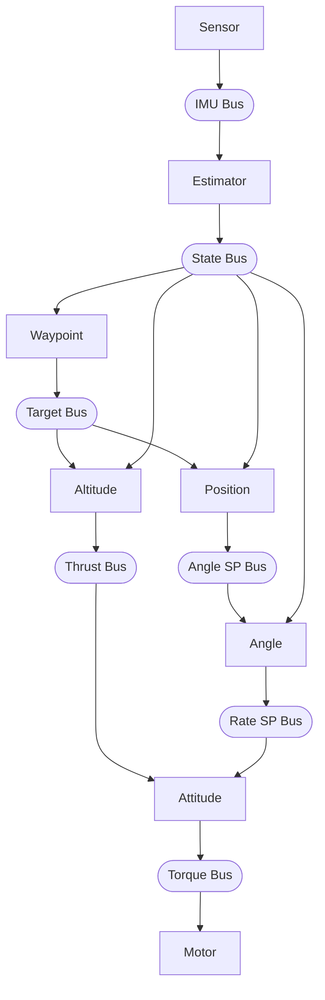

# Pilot Example

Quadcopter hover example using hive actor runtime with Webots simulator.

## What it does

Demonstrates 3D waypoint navigation with a Crazyflie quadcopter using 8 actors:

1. **Sensor actor** reads IMU/GPS from Webots, publishes to IMU bus
2. **Estimator actor** sensor fusion, computes velocities, publishes to state bus
3. **Altitude actor** reads target altitude from target bus, runs altitude PID
4. **Waypoint actor** manages 3D waypoint list (x, y, z, yaw), publishes to target bus
5. **Position actor** reads target XY/yaw from target bus, runs position PD
6. **Angle actor** runs angle PIDs, publishes rate setpoints
7. **Attitude actor** runs rate PIDs, publishes torque commands
8. **Motor actor** applies X-config mixer, enforces safety limits, writes to hardware

The drone flies a square pattern with altitude changes at each waypoint.

## Prerequisites

- Webots installed (https://cyberbotics.com/)
- hive runtime built: `cd ../.. && make`

## Build and Run

```bash
export WEBOTS_HOME=/usr/local/webots  # adjust path
make
make install
```

Then open `worlds/hover_test.wbt` in Webots and start the simulation.

## Files

```
pilot.c              # Main loop, platform layer, bus setup
sensor_actor.c/h     # Hardware sensor reading → IMU bus
estimator_actor.c/h  # Sensor fusion → state bus
altitude_actor.c/h   # Altitude PID → thrust
waypoint_actor.c/h   # Waypoint manager → target bus
position_actor.c/h   # Position PD → angle setpoints
angle_actor.c/h      # Angle PIDs → rate setpoints
attitude_actor.c/h   # Rate PIDs → torque commands
motor_actor.c/h      # Mixer + safety: torque → motors → hardware
pid.c/h              # Reusable PID controller
types.h              # Portable data types
config.h             # Shared constants (PID gains, timing)
```

## Architecture

Eight actors connected via buses:



Platform layer (in pilot.c) provides hardware abstraction:
- `platform_read_imu()` - reads Webots sensors
- `platform_write_motors()` - writes Webots motors

To port to real hardware, replace these functions.

## Actor Priorities and Spawn Order

All actors run at CRITICAL priority. Spawn order determines execution order
within the same priority level (round-robin). Actors are spawned in data-flow
order to ensure each actor sees fresh data from upstream actors in the same step:

| Order | Actor     | Priority | Rationale |
|-------|-----------|----------|-----------|
| 1     | sensor    | CRITICAL | Reads hardware first |
| 2     | estimator | CRITICAL | Needs IMU, produces state estimate |
| 3     | altitude  | CRITICAL | Needs state, produces thrust |
| 4     | waypoint  | CRITICAL | Needs state, produces position targets |
| 5     | position  | CRITICAL | Needs target, produces angle setpoints |
| 6     | angle     | CRITICAL | Needs angle setpoints, produces rate setpoints |
| 7     | attitude  | CRITICAL | Needs state + thrust + rate setpoints |
| 8     | motor     | CRITICAL | Needs torque, writes hardware last |

## Control System

### PID Controllers (tuned in config.h)

| Controller | Kp   | Ki   | Kd    | Purpose |
|------------|------|------|-------|---------|
| Altitude   | 0.3  | 0.05 | 0     | Hold 1.0m height (PI + velocity damping) |
| Position   | 0.2  | -    | 0.1   | Hold XY position (PD, max tilt 0.35 rad) |
| Angle      | 4.0  | 0    | 0     | Level attitude (roll/pitch) |
| Yaw angle  | 4.0  | 0    | 0     | Heading hold (uses pid_update_angle for wrap-around) |
| Roll rate  | 0.02 | 0    | 0.001 | Stabilize roll |
| Pitch rate | 0.02 | 0    | 0.001 | Stabilize pitch |
| Yaw rate   | 0.02 | 0    | 0.001 | Stabilize yaw |

Altitude control uses measured vertical velocity for damping (Kv=0.15) instead
of differentiating position error. This provides smoother response with less noise.

Position control uses simple PD with velocity damping. Commands are transformed
from world frame to body frame based on current yaw. Heading hold is achieved
via yaw angle setpoint published to the angle actor, which uses `pid_update_angle()`
to handle the ±π wrap-around correctly.

### Waypoint Navigation

The waypoint actor manages a list of 3D waypoints and publishes the current target
to the target bus. Both altitude and position actors read from the target bus.

**Demo route (square pattern with gentle altitude changes):**
1. (0, 0, 1.0m) heading 0° - start at 1m
2. (1, 0, 1.2m) heading 0° - rise to 1.2m
3. (1, 1, 1.4m) heading 90° - rise to 1.4m, face east
4. (0, 1, 1.2m) heading 180° - drop to 1.2m, face south
5. (0, 0, 1.0m) heading 0° - return to 1m

**Arrival detection:** The drone must satisfy all conditions before advancing:
- XY position within 0.15m of waypoint
- Altitude within 0.15m of target
- Heading within 0.1 rad (~6°) of target
- Velocity below 0.1 m/s (nearly stopped)
- Hover at waypoint for 200ms

After completing the route, the drone loops back to the first waypoint and repeats forever.

### Motor Mixer (in motor_actor, X Configuration)

The Webots Crazyflie uses X-configuration (matching Bitcraze):

```
        Front
      M2    M3
        \  /
         \/
         /\
        /  \
      M1    M4
        Rear

M1 = thrust - roll + pitch + yaw  (rear-left)
M2 = thrust - roll - pitch - yaw  (front-left)
M3 = thrust + roll - pitch + yaw  (front-right)
M4 = thrust + roll + pitch - yaw  (rear-right)
```

## Main Loop

The main loop is minimal - all logic is in actors:

```c
while (wb_robot_step(TIME_STEP_MS) != -1) {
    hive_step();
}
```

Webots controls time via `wb_robot_step()`. Each call:
1. Blocks until Webots simulates TIME_STEP milliseconds
2. Returns, allowing `hive_step()` to run all actors once
3. Actors read sensors, compute, publish results
4. Loop repeats

## Webots Device Names

| Device | Name | Type |
|--------|------|------|
| Motor 1 (rear-left) | `m1_motor` | RotationalMotor |
| Motor 2 (front-left) | `m2_motor` | RotationalMotor |
| Motor 3 (front-right) | `m3_motor` | RotationalMotor |
| Motor 4 (rear-right) | `m4_motor` | RotationalMotor |
| Gyroscope | `gyro` | Gyro |
| Inertial Unit | `inertial_unit` | InertialUnit |
| GPS | `gps` | GPS |
