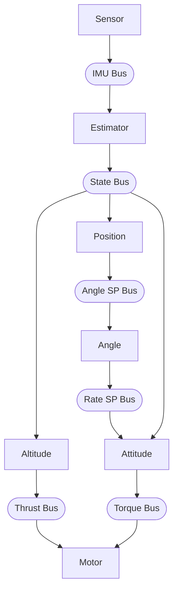

# Pilot Example

Quadcopter hover example using hive actor runtime with Webots simulator.

## What it does

Demonstrates altitude-hold and position-hold control with a Crazyflie quadcopter using 7 actors:

1. **Sensor actor** reads IMU/GPS from Webots, publishes to IMU bus
2. **Estimator actor** sensor fusion, computes velocities, publishes to state bus
3. **Altitude actor** runs altitude PID, publishes thrust commands
4. **Position actor** runs position PD, publishes angle setpoints
5. **Angle actor** runs angle PIDs, publishes rate setpoints
6. **Attitude actor** runs rate PIDs, publishes torque commands
7. **Motor actor** applies X-config mixer, enforces safety limits, writes to hardware

The drone rises to 1.0m altitude and holds XY position.

## Prerequisites

- Webots installed (https://cyberbotics.com/)
- hive runtime built: `cd ../.. && make`

## Build and Run

```bash
export WEBOTS_HOME=/usr/local/webots  # adjust path
make
make install
```

Then open `worlds/hover_test.wbt` in Webots and start the simulation.

## Files

```
pilot.c              # Main loop, platform layer, bus setup
sensor_actor.c/h     # Hardware sensor reading → IMU bus
estimator_actor.c/h  # Sensor fusion → state bus
altitude_actor.c/h   # Altitude PID → thrust
position_actor.c/h   # Position PD → angle setpoints
angle_actor.c/h      # Angle PIDs → rate setpoints
attitude_actor.c/h   # Rate PIDs → torque commands
motor_actor.c/h      # Mixer + safety: torque → motors → hardware
pid.c/h              # Reusable PID controller
types.h              # Portable data types
config.h             # Shared constants (PID gains, timing)
```

## Architecture

Seven actors connected via buses:



Platform layer (in pilot.c) provides hardware abstraction:
- `platform_read_imu()` - reads Webots sensors
- `platform_write_motors()` - writes Webots motors

To port to real hardware, replace these functions.

## Actor Priorities and Spawn Order

All actors run at CRITICAL priority. Spawn order determines execution order
within the same priority level (round-robin). Actors are spawned in data-flow
order to ensure each actor sees fresh data from upstream actors in the same step:

| Order | Actor     | Priority | Rationale |
|-------|-----------|----------|-----------|
| 1     | sensor    | CRITICAL | Reads hardware first |
| 2     | estimator | CRITICAL | Needs IMU, produces state estimate |
| 3     | altitude  | CRITICAL | Needs state, produces thrust |
| 4     | position  | CRITICAL | Needs state, produces angle setpoints |
| 5     | angle     | CRITICAL | Needs angle setpoints, produces rate setpoints |
| 6     | attitude  | CRITICAL | Needs state + thrust + rate setpoints |
| 7     | motor     | CRITICAL | Needs torque, writes hardware last |

## Control System

### PID Controllers (tuned in config.h)

| Controller | Kp   | Ki   | Kd    | Purpose |
|------------|------|------|-------|---------|
| Altitude   | 0.3  | 0.05 | 0     | Hold 1.0m height (PI + velocity damping) |
| Position   | 0.2  | -    | 0.1   | Hold XY position (PD, max tilt 0.35 rad) |
| Angle      | 4.0  | 0    | 0     | Level attitude |
| Roll rate  | 0.02 | 0    | 0.001 | Stabilize roll |
| Pitch rate | 0.02 | 0    | 0.001 | Stabilize pitch |
| Yaw rate   | 0.02 | 0    | 0.001 | Stabilize yaw |

Altitude control uses measured vertical velocity for damping (Kv=0.15) instead
of differentiating position error. This provides smoother response with less noise.

Position control uses simple PD with velocity damping. Sign conventions match
the Bitcraze Webots controller.

### Motor Mixer (in motor_actor, X Configuration)

The Webots Crazyflie uses X-configuration (matching Bitcraze):

```
        Front
      M2    M3
        \  /
         \/
         /\
        /  \
      M1    M4
        Rear

M1 = thrust - roll + pitch + yaw  (rear-left)
M2 = thrust - roll - pitch - yaw  (front-left)
M3 = thrust + roll - pitch + yaw  (front-right)
M4 = thrust + roll + pitch - yaw  (rear-right)
```

## Main Loop

The main loop is minimal - all logic is in actors:

```c
while (wb_robot_step(TIME_STEP_MS) != -1) {
    hive_step();
}
```

Webots controls time via `wb_robot_step()`. Each call:
1. Blocks until Webots simulates TIME_STEP milliseconds
2. Returns, allowing `hive_step()` to run all actors once
3. Actors read sensors, compute, publish results
4. Loop repeats

## Webots Device Names

| Device | Name | Type |
|--------|------|------|
| Motor 1 (front) | `m1_motor` | RotationalMotor |
| Motor 2 (right) | `m2_motor` | RotationalMotor |
| Motor 3 (rear) | `m3_motor` | RotationalMotor |
| Motor 4 (left) | `m4_motor` | RotationalMotor |
| Gyroscope | `gyro` | Gyro |
| Inertial Unit | `inertial_unit` | InertialUnit |
| GPS | `gps` | GPS |
