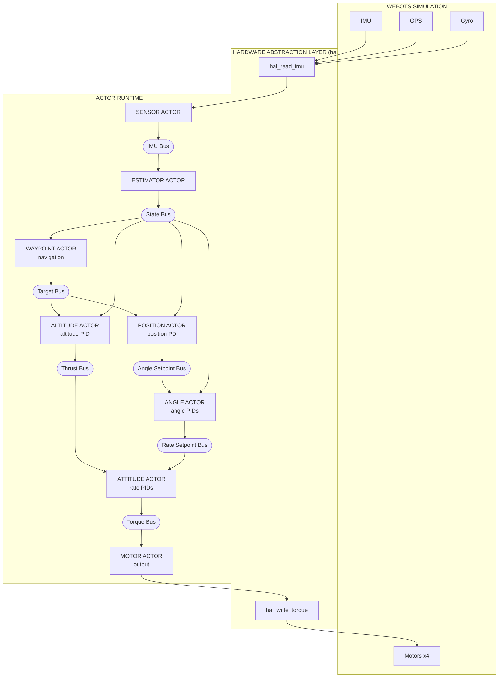
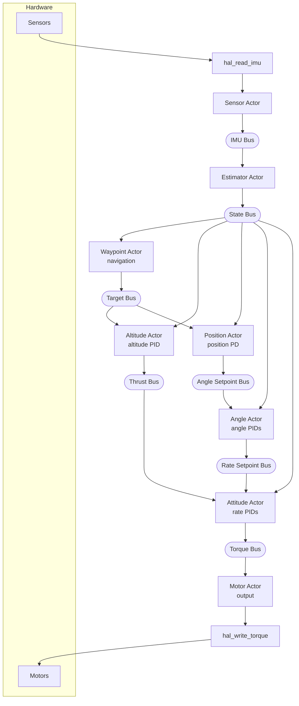

# Pilot Example Specification

A quadcopter autopilot example using the actor runtime. Supports Webots simulation
(default) and STM32 hardware (STEVAL-DRONE01).

## Status

**Implemented:**
- Altitude-hold hover with attitude stabilization
- Horizontal position hold (GPS-based XY control)
- Heading hold (yaw control with angle wrap-around)
- Waypoint navigation (square demo route with altitude and heading changes)
- Step 1: Motor actor (mixer, safety, watchdog)
- Step 2: Separate altitude actor (altitude/rate split)
- Step 3: Sensor actor (hardware abstraction)
- Step 4: Angle actor (attitude angle control)
- Step 5: Estimator actor (sensor fusion, vertical velocity)
- Step 6: Position actor (horizontal position hold + heading hold)
- Step 7: Waypoint actor (waypoint navigation)
- Mixer moved to HAL (platform-specific, X-configuration)

## Goals

1. **Showcase the actor runtime** - demonstrate benefits of actor-based design for embedded systems
2. **Improve the runtime** - if problems arise (latency, scheduling), fix the runtime, don't work around it
3. **Beautiful code** - show how an autopilot can be elegantly written using actors
4. **Hover control** - maintain stable altitude and attitude
5. **Clean architecture** - portable actor code with HAL abstraction
6. **Webots integration** - use `hive_advance_time()` + `hive_run_until_blocked()` per simulation step

The pilot serves dual purposes: a real-world stress test that exposes runtime weaknesses, and a showcase of clean actor-based embedded design.

## Design Decisions

### Why buses instead of IPC?

- **Buses** provide latest-value semantics - subscribers get current state, not history
- **IPC notify** queues every message - slow consumers would process stale data
- For control loops, you always want the *latest* sensor reading, not a backlog

### Why max_entries=1?

All buses use `max_entries=1` (single entry, latest value only):

```c
hive_bus_config cfg = HIVE_BUS_CONFIG_DEFAULT;
cfg.max_entries = 1;  // Latest value only - correct for real-time control
```

- Control loops need current state, not history
- If a subscriber is slow, it should skip stale data, not queue it
- Larger buffers would cause processing of outdated sensor readings
- This matches how real flight controllers handle sensor data

## Non-Goals (Future Work)

- Full state estimation (Kalman filter)
- Failsafe handling
- Parameter tuning UI
- Multiple vehicle types

## Limitations (Production Requirements)

**This example is a demonstration, not production-ready flight software.**

A production flight controller would need error handling and failsafes that this example omits:

### Missing Error Handling

| Scenario | Current Behavior | Production Requirement |
|----------|------------------|------------------------|
| Sensor read fails | `BUS_READ()` returns false, actor skips iteration | Watchdog timeout, switch to backup sensor or land |
| Bus publish fails | Error ignored | Log error, trigger failsafe |
| Actor crashes | Runtime notifies linked actors | Auto-restart or emergency landing |
| GPS signal lost | Position control uses stale data | Hold last position, descend slowly, or return-to-home |
| IMU data invalid | Garbage in, garbage out | Sanity checks, sensor voting, reject outliers |

### Missing Safety Features

- **Motor watchdog**: motor_actor has a watchdog but only cuts thrust - no graceful landing
- **Geofence**: No boundary limits - drone can fly away indefinitely
- **Battery monitoring**: No low-voltage warning or auto-land
- **Arming/disarming**: No safety switch to prevent accidental motor start
- **Pre-flight checks**: No sensor validation before takeoff
- **Communication loss**: No failsafe if telemetry link drops

### Why These Are Omitted

This example focuses on demonstrating the actor runtime architecture, not building a safe drone. Adding proper failsafes would obscure the core concepts (actors, buses, control loops) with error handling code.

For a production system, each actor should:
1. Validate inputs before processing
2. Handle bus read/write failures
3. Implement timeouts for expected data
4. Report health status to a supervisor actor
5. Respond to emergency stop commands

---

## Architecture Overview

Eight actors connected via buses:



---

## Implementation Details

### Multi-File Design

Code is split into focused modules:

| File | Purpose |
|------|---------|
| `pilot.c` | Main loop, bus setup, actor spawn |
| `sensor_actor.c/h` | Reads IMU via HAL, publishes to IMU bus |
| `estimator_actor.c/h` | Sensor fusion → state bus |
| `altitude_actor.c/h` | Altitude PID → thrust |
| `waypoint_actor.c/h` | Waypoint navigation → target bus |
| `position_actor.c/h` | Position PD → angle setpoints |
| `angle_actor.c/h` | Angle PIDs → rate setpoints |
| `attitude_actor.c/h` | Rate PIDs → torque commands |
| `motor_actor.c/h` | Output: torque → HAL → motors |
| `pid.c/h` | Reusable PID controller |
| `types.h` | Portable data types |
| `config.h` | All tuning parameters and constants |

### Data Flow



---

## Control Algorithms

### PID Controller

Standard discrete PID with anti-windup:

```c
float pid_update(pid_state_t *pid, float setpoint, float measurement, float dt) {
    float error = setpoint - measurement;

    float p = pid->kp * error;

    pid->integral += error * dt;
    pid->integral = clamp(pid->integral, -integral_max, integral_max);
    float i = pid->ki * pid->integral;

    float d = pid->kd * (error - pid->prev_error) / dt;
    pid->prev_error = error;

    return clamp(p + i + d, -output_max, output_max);
}
```

### Tuned PID Gains

| Controller | Kp   | Ki   | Kd    | Output Max | Purpose |
|------------|------|------|-------|------------|---------|
| Altitude   | 0.3  | 0.05 | 0     | 0.15       | Track target altitude (PI) |
| Position   | 0.2  | -    | 0.1   | 0.35 rad   | Track target XY (PD) |
| Yaw angle  | 4.0  | 0    | 0     | 3.0 rad/s  | Track target heading (P) |
| Roll angle | 4.0  | 0    | 0     | 3.0 rad/s  | Level attitude |
| Pitch angle| 4.0  | 0    | 0     | 3.0 rad/s  | Level attitude |
| Roll rate  | 0.02 | 0    | 0.001 | 0.1        | Stabilize roll |
| Pitch rate | 0.02 | 0    | 0.001 | 0.1        | Stabilize pitch |
| Yaw rate   | 0.02 | 0    | 0.001 | 0.15       | Stabilize yaw |

**Altitude velocity damping:** Kv = 0.15
**Position control:** PD controller with velocity damping, max tilt 0.35 rad (~20°)
**Heading control:** Uses `pid_update_angle()` with ±π wrap-around for shortest path

Altitude control uses measured vertical velocity for damping instead of
differentiating position error. This provides smoother response with less noise:
```
thrust = BASE_THRUST + PI_correction - Kv * vertical_velocity
```

Base thrust: 0.553 (approximate hover thrust for Webots Crazyflie model)

### Mixer (Platform-Specific, X Configuration)

The motor mixer converts torque commands (thrust, roll, pitch, yaw) to individual
motor commands. Each HAL implementation contains its own mixer since different
platforms have different motor rotation directions and sign conventions.

Both platforms use X-configuration where each motor affects both roll and pitch.
Motor layout:

```
        Front
      M2    M3
        \  /
         \/
         /\
        /  \
      M1    M4
        Rear
```

**Crazyflie (hal/webots-crazyflie/):** Matches official Bitcraze firmware
```
M1 (rear-left, CCW):   thrust - roll + pitch + yaw
M2 (front-left, CW):   thrust - roll - pitch - yaw
M3 (front-right, CCW): thrust + roll - pitch + yaw
M4 (rear-right, CW):   thrust + roll + pitch - yaw
```

**STEVAL-DRONE01 (hal/STEVAL-DRONE01/):** Different sign conventions
```
M1 (rear-left, CCW):   thrust + roll + pitch - yaw
M2 (front-left, CW):   thrust + roll - pitch + yaw
M3 (front-right, CCW): thrust - roll - pitch - yaw
M4 (rear-right, CW):   thrust - roll + pitch + yaw
```

The mixer is implemented in each HAL's `hal_write_torque()` function.

### Motor Velocity Signs

The Webots Crazyflie model requires specific velocity signs to cancel reaction torque:

- **M1, M3** (front, rear): Negative velocity
- **M2, M4** (right, left): Positive velocity

```c
static const float signs[4] = {-1.0f, 1.0f, -1.0f, 1.0f};
```

---

## Webots Integration

### Simulation Loop

The main loop is minimal - all logic lives in actors:

```c
while (hal_step()) {
    hive_advance_time(HAL_TIME_STEP_US);  // Advance simulation time, fire due timers
    hive_run_until_blocked();              // Run actors until all blocked
}
```

Each simulation step fires the sensor_actor's timer, which triggers the control chain:
1. Sensor actor reads hardware, publishes to IMU bus
2. Estimator actor reads IMU bus, publishes state estimate
3. Altitude actor reads state bus, publishes thrust
4. Waypoint actor reads state bus, publishes position target
5. Position actor reads target bus, publishes angle setpoints
6. Angle actor reads angle setpoints, publishes rate setpoints
7. Attitude actor reads state + thrust + rate setpoints, publishes torque commands
8. Motor actor applies mixer, writes to hardware

### Key Parameters

- `TIME_STEP = 4` ms (250 Hz control rate)
- `MOTOR_MAX_VELOCITY = 100.0` rad/s
- Waypoint tolerance: 0.15 m XY, 0.15 m altitude, 0.1 rad heading, 0.1 m/s velocity
- Waypoint hover time: 200 ms before advancing

### Webots Device Names

| Device | Name | Type |
|--------|------|------|
| Motor 1 (rear-left) | `m1_motor` | RotationalMotor |
| Motor 2 (front-left) | `m2_motor` | RotationalMotor |
| Motor 3 (front-right) | `m3_motor` | RotationalMotor |
| Motor 4 (rear-right) | `m4_motor` | RotationalMotor |
| Gyroscope | `gyro` | Gyro |
| Inertial Unit | `inertial_unit` | InertialUnit |
| GPS | `gps` | GPS |

---

## Portability

### Hardware Abstraction Layer (HAL)

All hardware access goes through `hal/hal.h`. Each platform provides its own
implementation of this interface:

```c
// Platform lifecycle
int hal_init(void);        // Initialize hardware
void hal_cleanup(void);    // Release resources
void hal_calibrate(void);  // Calibrate sensors
void hal_arm(void);        // Enable motor output
void hal_disarm(void);     // Disable motor output

// Sensor interface (called by sensor_actor)
void hal_read_imu(imu_data_t *imu);

// Motor interface (called by motor_actor)
void hal_write_torque(const torque_cmd_t *cmd);

// Simulation time (only for SIMULATED_TIME builds)
bool hal_step(void);  // Advance simulation, returns false when done
```

Actors use the HAL directly - no function pointers needed:
- `sensor_actor.c` calls `hal_read_imu()`
- `motor_actor.c` calls `hal_write_torque()`

### Supported Platforms

**Webots simulation (default):**
- HAL implementation: `hal/webots-crazyflie/hal_webots.c`
- Build with: `make` (sets `-DSIMULATED_TIME`)
- Uses `webots/robot.h` APIs

**STM32 hardware (STEVAL-DRONE01):**
- HAL implementation: `hal/STEVAL-DRONE01/hal_stm32.c`
- Build with: `make -f Makefile.STEVAL-DRONE01`
- Flash with: `make -f Makefile.STEVAL-DRONE01 flash`
- Memory: 34 KB flash, 29 KB RAM (fits STM32F401 with 67 KB headroom)

### Platform Differences

All hardware differences are encapsulated in the HAL. Actor code is identical
across platforms.

| Component | Webots (Crazyflie) | STM32 (STEVAL-DRONE01) | Location |
|-----------|-------------------|------------------------|----------|
| Motor mixer | Crazyflie formula | STEVAL formula | HAL `hal_write_torque()` |
| Pitch sign | Negated in mixer | Standard | HAL `hal_write_torque()` |
| Motor output | Signed velocity | Unsigned PWM duty cycle | HAL implementation |
| Sensor reading | Webots API | STM32 drivers | HAL `hal_read_imu()` |

The only compile-time difference in pilot.c is `SIMULATED_TIME`:

| Mode | Build flag | Main loop | Time control |
|------|------------|-----------|--------------|
| Simulation | `-DSIMULATED_TIME` | `hal_step()` + `hive_advance_time()` + `hive_run_until_blocked()` | External (Webots) |
| Real-time | (none) | `hive_run()` | Wall clock |

**Known limitations on STM32:**

| Issue | Impact | Workaround |
|-------|--------|------------|
| No GPS/position feedback | x,y return 0.0 | Waypoints are altitude-only (x=0, y=0); drone hovers in place and cycles through altitudes |
| Motor pin conflict | Only 2 of 4 motors on default pins | Use port D pins (PD12-PD15) via `motors_init_full()` |
| PID gains | Tuned for Webots Crazyflie | May need retuning for hardware |
| TIME_STEP_S mismatch | PIDs use 4ms but STM32 runs at 2.5ms | Gains absorb difference; retune if needed |

### Portable Code

All actor code is platform-independent. Actors use:
- Bus API for inter-actor communication
- HAL API for hardware access (abstracted)

| File | Dependencies |
|------|--------------|
| `sensor_actor.c/h` | HAL (hal_read_imu) + bus API |
| `estimator_actor.c/h` | Bus API only |
| `altitude_actor.c/h` | Bus API only |
| `waypoint_actor.c/h` | Bus API only |
| `position_actor.c/h` | Bus API only |
| `angle_actor.c/h` | Bus API only |
| `attitude_actor.c/h` | Bus API only |
| `motor_actor.c/h` | HAL (hal_write_torque) + bus API |
| `pid.c/h` | Pure C, no runtime deps |
| `types.h` | Data structures |
| `config.h` | Tuning parameters |

---

## File Structure

```
examples/pilot/
    pilot.c              # Main loop, bus setup, actor spawn
    sensor_actor.c/h     # Reads IMU via HAL → IMU bus
    estimator_actor.c/h  # Sensor fusion → state bus
    altitude_actor.c/h   # Altitude PID → thrust
    waypoint_actor.c/h   # Waypoint navigation → target bus
    position_actor.c/h   # Position PD → angle setpoints
    angle_actor.c/h      # Angle PIDs → rate setpoints
    attitude_actor.c/h   # Rate PIDs → torque commands
    motor_actor.c/h      # Output: torque → HAL → motors
    pid.c/h              # Reusable PID controller
    types.h              # Portable data types
    config.h             # Shared constants
    Makefile                 # Webots simulation build
    Makefile.STEVAL-DRONE01  # STM32 hardware build
    SPEC.md              # This specification
    README.md            # Usage instructions
    worlds/
        hover_test.wbt   # Webots world file
    controllers/
        pilot/           # Webots controller (installed here)
    hal/
        hal.h                # Common HAL interface
        webots-crazyflie/    # Webots simulation HAL
            hal_webots.c     # Webots implementation
        STEVAL-DRONE01/      # STM32F401 HAL
            hal_stm32.c      # STM32 wrapper
            platform_*.c/h   # Low-level drivers
```

---

## Testing Results

### Hover Behavior

1. Drone starts at 0.5m altitude (world file setting)
2. Altitude PID commands increased thrust
3. Drone rises with some initial oscillation
4. Settles at 1.0m within ~3 seconds
5. Maintains stable hover at 1.0m ± 0.05m

### Console Output

```
Pilot started - hover mode
alt=0.01 thrust=0.75 | roll=  0.0 pitch=  0.0
alt=0.02 thrust=0.75 | roll=  0.0 pitch=  0.0
alt=1.41 thrust=0.35 | roll=  0.0 pitch=  0.0
...
alt=1.05 thrust=0.55 | roll=  0.0 pitch=  0.0
alt=1.04 thrust=0.55 | roll=  0.0 pitch=  0.0
alt=1.01 thrust=0.55 | roll=  0.0 pitch=  0.0
```

---

## Architecture Evolution Roadmap

The example will evolve incrementally toward a clean multi-actor design.
Each step maintains a working system while improving separation of concerns.

### Target Architecture


### Actor Responsibilities (Current)

| Actor | Input | Output | Priority | Responsibility |
|-------|-------|--------|----------|----------------|
| **Sensor** | Hardware | IMU Bus | CRITICAL | Read IMU/GPS, timestamp, publish |
| **Estimator** | IMU Bus | State Bus | CRITICAL | Sensor fusion, state estimate |
| **Altitude** | State + Target Bus | Thrust Bus | CRITICAL | Altitude PID (250Hz) |
| **Waypoint** | State Bus | Target Bus | CRITICAL | 3D waypoint navigation, loops forever |
| **Position** | Target + State Bus | Angle Setpoint Bus | CRITICAL | Position PD (250Hz) |
| **Angle** | Angle Setpoint + State | Rate Setpoint Bus | CRITICAL | Angle PIDs (250Hz) |
| **Attitude** | State + Thrust + Rate SP | Torque Bus | CRITICAL | Rate PIDs (250Hz) |
| **Motor** | Torque Bus | Hardware | CRITICAL | Output to hardware via HAL |

### Step 1: Motor Actor ✓

Separate motor output into dedicated actor.

```
Attitude Actor ──► Torque Bus ──► Motor Actor ──► HAL ──► Hardware
                                  (output)         (mixer)
```

**Features:** Subscribe to torque bus, call HAL for motor output. Mixer is in HAL.

### Step 2: Separate Altitude Actor ✓

Split altitude control from rate control.

```
IMU Bus ──► Altitude Actor ──► Thrust Bus ──► Attitude Actor ──► Torque Bus
            (altitude PID)                    (rate PIDs only)
```

**Benefits:** Clear separation, different rates possible, easier tuning.

### Step 3: Sensor Actor ✓

Move sensor reading from main loop into actor.

```
Main Loop: hal_step() + hive_advance_time() + hive_run_until_blocked()
Sensor Actor: timer ──► hal_read_imu() ──► IMU Bus
```

**Benefits:** Main loop is minimal, all logic in timer-driven actors.

### Step 4: Angle Actor ✓

Add attitude angle control between altitude and rate control.

**Before:**
```
IMU Bus ──► Attitude Actor (rate PIDs with hardcoded 0.0 setpoints)
```

**After:**
```
IMU Bus ──► Angle Actor ──► Rate Setpoint Bus ──► Attitude Actor
            (angle PIDs)                          (rate PIDs)
```

**Benefits:**
- Cascaded control (proper drone architecture)
- Angle controller generates rate setpoints
- Rate controller tracks those setpoints
- Easier to tune each layer independently

### Step 5: Estimator Actor ✓

Add sensor fusion between raw sensors and controllers.

**Before:**
```
Sensor Actor ──► IMU Bus ──► Controllers
```

**After:**
```
Sensor Actor ──► IMU Bus ──► Estimator Actor ──► State Bus ──► Controllers
                             (sensor fusion)
```

**Implementation:**
- For Webots: Mostly pass-through (inertial_unit provides clean attitude)
- Computes vertical velocity by differentiating GPS altitude with low-pass filter
- For real hardware: Would implement complementary filter or Kalman filter

**Benefits:**
- Controllers use state estimate, not raw sensors
- Derived values (vertical velocity) computed in one place
- Clean abstraction for real hardware sensor fusion

### Step 6: Position Actor ✓

Add horizontal position hold and heading hold.

**Before:**
```
Angle Actor uses hardcoded 0.0 angle setpoints
```

**After:**
```
State Bus ──► Position Actor ──► Angle Setpoint Bus ──► Angle Actor
              (position PD)       (roll, pitch, yaw)    (angle PIDs)
```

**Implementation:**
- Simple PD controller: position error → angle command
- Velocity damping: reduces overshoot
- Max tilt limit: 0.35 rad (~20°) for safety
- Sign conventions match Bitcraze Webots controller
- Heading hold: publishes target yaw from waypoint actor
- Angle wrap-around: `pid_update_angle()` handles ±π discontinuity
- World-to-body frame transformation based on current yaw

**Benefits:**
- Drone holds XY position and heading
- Returns to target when displaced or rotated
- Takes shortest rotation path (never rotates >180°)

### Step 7: Waypoint Actor ✓

Add 3D waypoint navigation with altitude changes.

**Before:**
```
Altitude Actor uses hardcoded TARGET_ALTITUDE
Position Actor uses hardcoded TARGET_X, TARGET_Y, TARGET_YAW
```

**After:**
```
                              ┌──► Altitude Actor (reads z)
State Bus ──► Waypoint Actor ──► Target Bus
              (navigation)       (x, y, z, yaw)
                              └──► Position Actor (reads x, y, yaw)
```

**Implementation:**
- Manages list of 3D waypoints (x, y, z, yaw)
- Publishes current target to target bus
- Altitude actor reads target altitude from target bus
- Position actor reads target XY and yaw from target bus
- Monitors state bus for arrival detection
- Arrival requires: XY position, altitude, heading within tolerance, velocity below threshold
- Hovers briefly at each waypoint before advancing
- Loops forever: returns to first waypoint after completing route
- Demo route: square pattern with gentle altitude changes (1.0m → 1.2m → 1.4m → 1.2m → 1.0m)

**Benefits:**
- Decouples waypoint logic from both position and altitude control
- Both actors read targets from bus (no hardcoded values)
- World-to-body frame transformation handles arbitrary headings
- Easy to extend with mission planning

### Step 8 (Future): RC Input / Mode Switching

**Future extensions:**
- RC input handling (manual override)
- Takeoff/landing sequences
- Mode switching (hover, land, follow-me, etc.)
- Dynamic waypoint updates via telemetry

---

## Memory Requirements

### STM32 Build (STEVAL-DRONE01)

Actual memory usage from `make -f Makefile.STEVAL-DRONE01`:

| Section | Size | Description |
|---------|------|-------------|
| Flash | 34 KB | Code + constants (7% of 512 KB) |
| RAM | 29 KB | Static data (30% of 96 KB) |

**RAM breakdown:**

| Component | Size | Notes |
|-----------|------|-------|
| Stack arena | 20 KB | 8 actors × 2 KB + headroom |
| Actor table | 1.2 KB | 10 slots |
| Message pool | 1 KB | 16 entries × 64 bytes |
| Bus structures | 2 KB | 8 buses + subscribers + entries |
| Other pools | 1 KB | Mailbox, timers, links, monitors |
| Main stack | 3 KB | Heap + stack for main() |

**Tightened configuration** (in Makefile.STEVAL-DRONE01):

| Resource | Used | Configured | Default |
|----------|------|------------|---------|
| Actors | 8 | 10 | 64 |
| Buses | 7 | 8 | 32 |
| Stack per actor | 2 KB | 2 KB | 64 KB |
| Stack arena | 16 KB | 20 KB | 1 MB |
| Mailbox entries | 1 | 16 | 256 |
| Message data | 7 | 16 | 256 |
| Timer entries | 1 | 4 | 64 |
| Link entries | 0 | 8 | 128 |
| Monitor entries | 0 | 8 | 128 |
| Max message size | 48 | 64 | 256 |

**Stack safety margin:** 4x (worst-case ~500 bytes per actor, 2048 available)

Fits comfortably on STM32F401 (96 KB RAM) with 67 KB headroom.

---

## Future Extensions

1. **Mission planning** - Load waypoints from file, complex routes
2. **Sensor fusion** - Complementary filter for better attitude estimation
3. **Failsafe** - Motor failure detection, emergency landing
4. **Telemetry** - Logging, MAVLink output
5. **RC input** - Manual control override
6. **Setpoint actor** - Altitude command generation, mode switching
