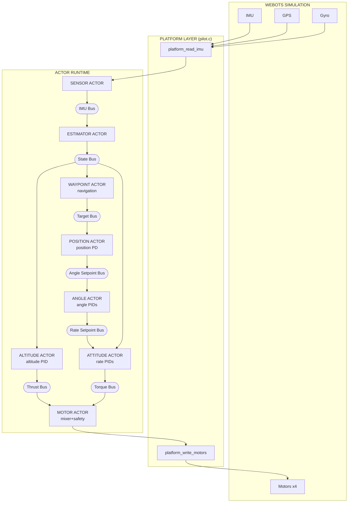
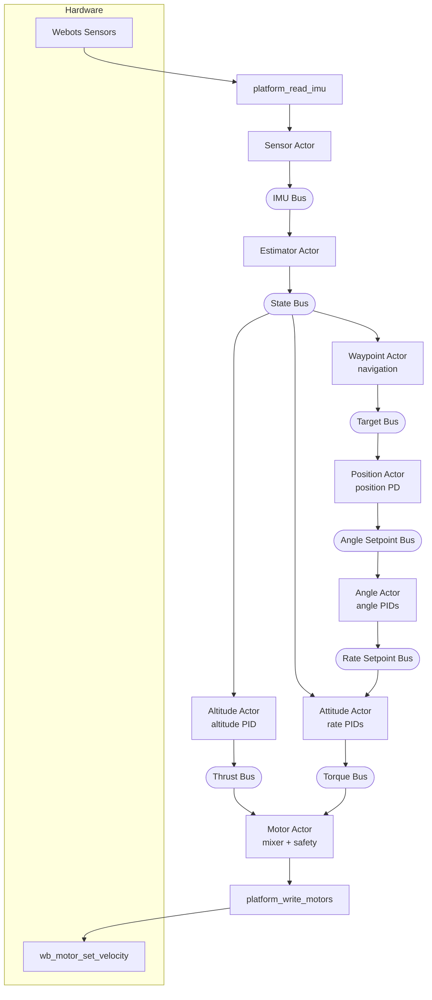
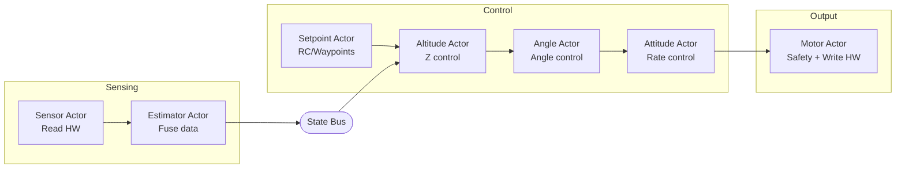

# Pilot Example Specification

A quadcopter autopilot example using the actor runtime with Webots simulator.

## Status

**Implemented:**
- Altitude-hold hover with attitude stabilization
- Horizontal position hold (GPS-based XY control)
- Heading hold (yaw control with angle wrap-around)
- Waypoint navigation (square demo route with heading changes)
- Step 1: Motor actor (mixer, safety, watchdog)
- Step 2: Separate altitude actor (altitude/rate split)
- Step 3: Sensor actor (hardware abstraction)
- Step 4: Angle actor (attitude angle control)
- Step 5: Estimator actor (sensor fusion, vertical velocity)
- Step 6: Position actor (horizontal position hold + heading hold)
- Step 7: Waypoint actor (waypoint navigation)
- Mixer moved to motor_actor (X-configuration for Crazyflie)

## Goals

1. **Showcase the actor runtime** - demonstrate benefits of actor-based design for embedded systems
2. **Improve the runtime** - if problems arise (latency, scheduling), fix the runtime, don't work around it
3. **Beautiful code** - show how an autopilot can be elegantly written using actors
4. **Hover control** - maintain stable altitude and attitude
5. **Clean architecture** - portable control code with platform abstraction
6. **Webots integration** - use `hive_step()` per simulation step

The pilot serves dual purposes: a real-world stress test that exposes runtime weaknesses, and a showcase of clean actor-based embedded design.

## Design Decisions

### Why buses instead of IPC?

- **Buses** provide latest-value semantics - subscribers get current state, not history
- **IPC notify** queues every message - slow consumers would process stale data
- For control loops, you always want the *latest* sensor reading, not a backlog

### Why max_entries=1?

All buses use `max_entries=1` (single entry, latest value only):

```c
hive_bus_config cfg = HIVE_BUS_CONFIG_DEFAULT;
cfg.max_entries = 1;  // Latest value only - correct for real-time control
```

- Control loops need current state, not history
- If a subscriber is slow, it should skip stale data, not queue it
- Larger buffers would cause processing of outdated sensor readings
- This matches how real flight controllers handle sensor data

## Non-Goals (Future Work)

- Full state estimation (Kalman filter)
- Failsafe handling
- Parameter tuning UI
- Multiple vehicle types

---

## Architecture Overview

Eight actors connected via buses:



---

## Implementation Details

### Multi-File Design

Code is split into focused modules:

| File | Purpose |
|------|---------|
| `pilot.c` | Main loop, platform layer, bus setup |
| `sensor_actor.c/h` | Reads hardware, publishes to IMU bus |
| `estimator_actor.c/h` | Sensor fusion → state bus |
| `altitude_actor.c/h` | Altitude PID → thrust |
| `waypoint_actor.c/h` | Waypoint navigation → target bus |
| `position_actor.c/h` | Position PD → angle setpoints |
| `angle_actor.c/h` | Angle PIDs → rate setpoints |
| `attitude_actor.c/h` | Rate PIDs → torque commands |
| `motor_actor.c/h` | Mixer + safety: torque → motors → hardware |
| `pid.c/h` | Reusable PID controller |
| `types.h` | Portable data types |
| `config.h` | All tuning parameters and constants |

### Data Flow



---

## Control Algorithms

### PID Controller

Standard discrete PID with anti-windup:

```c
float pid_update(pid_state_t *pid, float setpoint, float measurement, float dt) {
    float error = setpoint - measurement;

    float p = pid->kp * error;

    pid->integral += error * dt;
    pid->integral = clamp(pid->integral, -integral_max, integral_max);
    float i = pid->ki * pid->integral;

    float d = pid->kd * (error - pid->prev_error) / dt;
    pid->prev_error = error;

    return clamp(p + i + d, -output_max, output_max);
}
```

### Tuned PID Gains

| Controller | Kp   | Ki   | Kd    | Output Max | Purpose |
|------------|------|------|-------|------------|---------|
| Altitude   | 0.3  | 0.05 | 0     | 0.15       | Hold 1.0m height (PI) |
| Position   | 0.2  | -    | 0.1   | 0.35 rad   | Hold XY position (PD) |
| Yaw angle  | 4.0  | 0    | 0     | 3.0 rad/s  | Hold heading (P) |
| Roll angle | 4.0  | 0    | 0     | 3.0 rad/s  | Level attitude |
| Pitch angle| 4.0  | 0    | 0     | 3.0 rad/s  | Level attitude |
| Roll rate  | 0.02 | 0    | 0.001 | 0.1        | Stabilize roll |
| Pitch rate | 0.02 | 0    | 0.001 | 0.1        | Stabilize pitch |
| Yaw rate   | 0.02 | 0    | 0.001 | 0.15       | Stabilize yaw |

**Altitude velocity damping:** Kv = 0.15
**Position control:** PD controller with velocity damping, max tilt 0.35 rad (~20°)
**Heading control:** Uses `pid_update_angle()` with ±π wrap-around for shortest path

Altitude control uses measured vertical velocity for damping instead of
differentiating position error. This provides smoother response with less noise:
```
thrust = BASE_THRUST + PI_correction - Kv * vertical_velocity
```

Base thrust: 0.553 (approximate hover thrust for Webots Crazyflie model)

### Mixer (in motor_actor, Crazyflie X Configuration)

The Webots Crazyflie uses X-configuration where each motor affects both roll and pitch:

```
        Front
      M2    M3
        \  /
         \/
         /\
        /  \
      M1    M4
        Rear

M1 (rear-left):   thrust - roll + pitch + yaw
M2 (front-left):  thrust - roll - pitch - yaw
M3 (front-right): thrust + roll - pitch + yaw
M4 (rear-right):  thrust + roll + pitch - yaw
```

This matches the official Bitcraze Webots controller.

### Motor Velocity Signs

The Webots Crazyflie model requires specific velocity signs to cancel reaction torque:

- **M1, M3** (front, rear): Negative velocity
- **M2, M4** (right, left): Positive velocity

```c
static const float signs[4] = {-1.0f, 1.0f, -1.0f, 1.0f};
```

---

## Webots Integration

### Simulation Loop

The main loop is minimal - all logic lives in actors:

```c
while (wb_robot_step(TIME_STEP_MS) != -1) {
    hive_step();
}
```

Each `hive_step()` runs all ready actors once:
1. Sensor actor reads hardware, publishes to IMU bus
2. Estimator actor reads IMU bus, publishes state estimate
3. Altitude actor reads state bus, publishes thrust
4. Waypoint actor reads state bus, publishes position target
5. Position actor reads target bus, publishes angle setpoints
6. Angle actor reads angle setpoints, publishes rate setpoints
7. Attitude actor reads state + thrust + rate setpoints, publishes torque commands
8. Motor actor applies mixer, writes to hardware

### Key Parameters

- `TIME_STEP = 4` ms (250 Hz control rate)
- `MOTOR_MAX_VELOCITY = 100.0` rad/s
- Target altitude: 1.0 m
- Waypoint tolerance: 0.15 m position, 0.1 rad heading, 0.1 m/s velocity
- Waypoint hover time: 200 ms before advancing

### Webots Device Names

| Device | Name | Type |
|--------|------|------|
| Motor 1 (front) | `m1_motor` | RotationalMotor |
| Motor 2 (right) | `m2_motor` | RotationalMotor |
| Motor 3 (rear) | `m3_motor` | RotationalMotor |
| Motor 4 (left) | `m4_motor` | RotationalMotor |
| Gyroscope | `gyro` | Gyro |
| Inertial Unit | `inertial_unit` | InertialUnit |
| GPS | `gps` | GPS |

---

## Portability

### Platform Abstraction

To port to real hardware, replace the platform functions in `pilot.c`:

```c
// Initialize hardware (sensors, motors)
int platform_init(void);

// Read sensors into portable struct (called by sensor_actor)
void platform_read_imu(imu_data_t *imu);

// Write motor commands (called by motor_actor)
void platform_write_motors(const motor_cmd_t *cmd);
```

Actors receive platform functions via init:
- `sensor_actor_init(bus, platform_read_imu)`
- `motor_actor_init(bus, platform_write_motors)`

### Portable Code (no hardware deps)

- `pid.c/h` - Generic PID controller
- `estimator_actor.c/h` - Uses only bus API
- `altitude_actor.c/h` - Uses only bus API
- `angle_actor.c/h` - Uses only bus API
- `attitude_actor.c/h` - Uses only bus API
- `types.h` - Data structures
- `config.h` - Tuning parameters

---

## File Structure

```
examples/pilot/
    pilot.c              # Main loop, platform layer, bus setup
    sensor_actor.c/h     # Hardware sensor reading → IMU bus
    estimator_actor.c/h  # Sensor fusion → state bus
    altitude_actor.c/h   # Altitude PID → thrust
    waypoint_actor.c/h   # Waypoint navigation → target bus
    position_actor.c/h   # Position PD → angle setpoints
    angle_actor.c/h      # Angle PIDs → rate setpoints
    attitude_actor.c/h   # Rate PIDs → torque commands
    motor_actor.c/h      # Mixer + safety: torque → motors → hardware
    pid.c/h              # Reusable PID controller
    types.h              # Portable data types
    config.h             # Shared constants
    Makefile             # Build with auto-deps
    SPEC.md              # This specification
    README.md            # Usage instructions
    worlds/
        hover_test.wbt   # Webots world file
    controllers/
        pilot/           # Webots controller (installed here)
```

---

## Testing Results

### Hover Behavior

1. Drone starts at 0.5m altitude (world file setting)
2. Altitude PID commands increased thrust
3. Drone rises with some initial oscillation
4. Settles at 1.0m within ~3 seconds
5. Maintains stable hover at 1.0m ± 0.05m

### Console Output

```
Pilot started - hover mode
alt=0.01 thrust=0.75 | roll=  0.0 pitch=  0.0
alt=0.02 thrust=0.75 | roll=  0.0 pitch=  0.0
alt=1.41 thrust=0.35 | roll=  0.0 pitch=  0.0
...
alt=1.05 thrust=0.55 | roll=  0.0 pitch=  0.0
alt=1.04 thrust=0.55 | roll=  0.0 pitch=  0.0
alt=1.01 thrust=0.55 | roll=  0.0 pitch=  0.0
```

---

## Architecture Evolution Roadmap

The example will evolve incrementally toward a clean multi-actor design.
Each step maintains a working system while improving separation of concerns.

### Target Architecture



### Actor Responsibilities (Current)

| Actor | Input | Output | Priority | Responsibility |
|-------|-------|--------|----------|----------------|
| **Sensor** | Hardware | IMU Bus | CRITICAL | Read IMU/GPS, timestamp, publish |
| **Estimator** | IMU Bus | State Bus | CRITICAL | Sensor fusion, state estimate |
| **Altitude** | State Bus | Thrust Bus | CRITICAL | Altitude PID (250Hz) |
| **Waypoint** | State Bus | Target Bus | CRITICAL | Waypoint navigation, arrival detection |
| **Position** | Target + State Bus | Angle Setpoint Bus | CRITICAL | Position PD (250Hz) |
| **Angle** | Angle Setpoint + State | Rate Setpoint Bus | CRITICAL | Angle PIDs (250Hz) |
| **Attitude** | State + Thrust + Rate SP | Torque Bus | CRITICAL | Rate PIDs (250Hz) |
| **Motor** | Torque Bus | Hardware | CRITICAL | Mixer, safety, limits, write motors |

### Step 1: Motor Actor ✓

Separate motor output into dedicated actor with mixer and safety features.

```
Attitude Actor ──► Torque Bus ──► Motor Actor ──► Hardware
                                  (mixer+safety)
```

**Features:** Subscribe to torque bus, apply mixer, enforce limits, watchdog, platform write.

### Step 2: Separate Altitude Actor ✓

Split altitude control from rate control.

```
IMU Bus ──► Altitude Actor ──► Thrust Bus ──► Attitude Actor ──► Torque Bus
            (altitude PID)                    (rate PIDs only)
```

**Benefits:** Clear separation, different rates possible, easier tuning.

### Step 3: Sensor Actor ✓

Move sensor reading from main loop into actor.

```
Main Loop: hive_step() only
Sensor Actor: platform_read_imu() ──► IMU Bus
```

**Benefits:** Main loop is now just `hive_step()`, all logic in actors.

### Step 4: Angle Actor ✓

Add attitude angle control between altitude and rate control.

**Before:**
```
IMU Bus ──► Attitude Actor (rate PIDs with hardcoded 0.0 setpoints)
```

**After:**
```
IMU Bus ──► Angle Actor ──► Rate Setpoint Bus ──► Attitude Actor
            (angle PIDs)                          (rate PIDs)
```

**Benefits:**
- Cascaded control (proper drone architecture)
- Angle controller generates rate setpoints
- Rate controller tracks those setpoints
- Easier to tune each layer independently

### Step 5: Estimator Actor ✓

Add sensor fusion between raw sensors and controllers.

**Before:**
```
Sensor Actor ──► IMU Bus ──► Controllers
```

**After:**
```
Sensor Actor ──► IMU Bus ──► Estimator Actor ──► State Bus ──► Controllers
                             (sensor fusion)
```

**Implementation:**
- For Webots: Mostly pass-through (inertial_unit provides clean attitude)
- Computes vertical velocity by differentiating GPS altitude with low-pass filter
- For real hardware: Would implement complementary filter or Kalman filter

**Benefits:**
- Controllers use state estimate, not raw sensors
- Derived values (vertical velocity) computed in one place
- Clean abstraction for real hardware sensor fusion

### Step 6: Position Actor ✓

Add horizontal position hold and heading hold.

**Before:**
```
Angle Actor uses hardcoded 0.0 angle setpoints
```

**After:**
```
State Bus ──► Position Actor ──► Angle Setpoint Bus ──► Angle Actor
              (position PD)       (roll, pitch, yaw)    (angle PIDs)
```

**Implementation:**
- Simple PD controller: position error → angle command
- Velocity damping: reduces overshoot
- Max tilt limit: 0.35 rad (~20°) for safety
- Sign conventions match Bitcraze Webots controller
- Heading hold: publishes TARGET_YAW as yaw setpoint
- Angle wrap-around: `pid_update_angle()` handles ±π discontinuity

**Benefits:**
- Drone holds XY position and heading
- Returns to target when displaced or rotated
- Takes shortest rotation path (never rotates >180°)

### Step 7: Waypoint Actor ✓

Add waypoint navigation.

**Before:**
```
Position Actor uses hardcoded TARGET_X, TARGET_Y, TARGET_YAW
```

**After:**
```
State Bus ──► Waypoint Actor ──► Target Bus ──► Position Actor
              (navigation)       (x, y, yaw)    (position PD)
```

**Implementation:**
- Manages list of waypoints (x, y, yaw)
- Publishes current target to target bus
- Monitors state bus for arrival detection
- Arrival requires: position within tolerance, heading within tolerance, velocity below threshold
- Hovers briefly at each waypoint before advancing
- Loops back to first waypoint after completing route
- Demo route: square pattern with 90° turns

**Benefits:**
- Decouples waypoint logic from position control
- Position actor reads targets from bus (no hardcoded values)
- World-to-body frame transformation handles arbitrary headings
- Easy to extend with mission planning

### Step 8 (Future): Setpoint Actor

Add altitude command generation actor.

**Before:**
```
Altitude Actor has hardcoded target_altitude = 1.0m
```

**After:**
```
Setpoint Actor ──► Setpoint Bus ──► Altitude Actor
(generates commands)                (tracks setpoint)
```

**Future extensions:**
- RC input handling
- Takeoff/landing sequences
- Mode switching (hover, land, etc.)

---

## Memory Requirements

### Code Size (Flash/ROM)

| Component | Text (code) |
|-----------|-------------|
| Pilot application | ~4 KB |
| Hive runtime | ~27 KB |
| **Total** | **~31 KB** |

Note: STM32 builds will differ slightly. Webots platform layer adds ~1.5 KB.

### RAM (Static Memory)

With default `hive_static_config.h`, the runtime uses ~1.2 MB RAM (mostly the 1 MB stack arena). This example needs far less.

**Minimal configuration for hover example:**

| Resource | Used | Default | Minimal |
|----------|------|---------|---------|
| Actors | 8 | 64 | 8 |
| Buses | 7 | 32 | 8 |
| Stack per actor | 1 KB | 64 KB | 1 KB |
| Stack arena | 4 KB | 1 MB | 4 KB |
| Mailbox entries | ~4 | 256 | 8 |
| Message data | ~4 | 256 | 8 |
| Timer entries | 0 | 64 | 4 |
| Link entries | 0 | 128 | 4 |
| Monitor entries | 0 | 128 | 4 |

**Result: ~8 KB RAM** vs default ~1.2 MB

This fits comfortably on small STM32 chips (e.g., STM32F103 with 20 KB RAM).

---

## Future Extensions

1. **Mission planning** - Load waypoints from file, complex routes
2. **Sensor fusion** - Complementary filter for better attitude estimation
3. **Failsafe** - Motor failure detection, emergency landing
4. **Telemetry** - Logging, MAVLink output
5. **RC input** - Manual control override
6. **Setpoint actor** - Altitude command generation, mode switching
