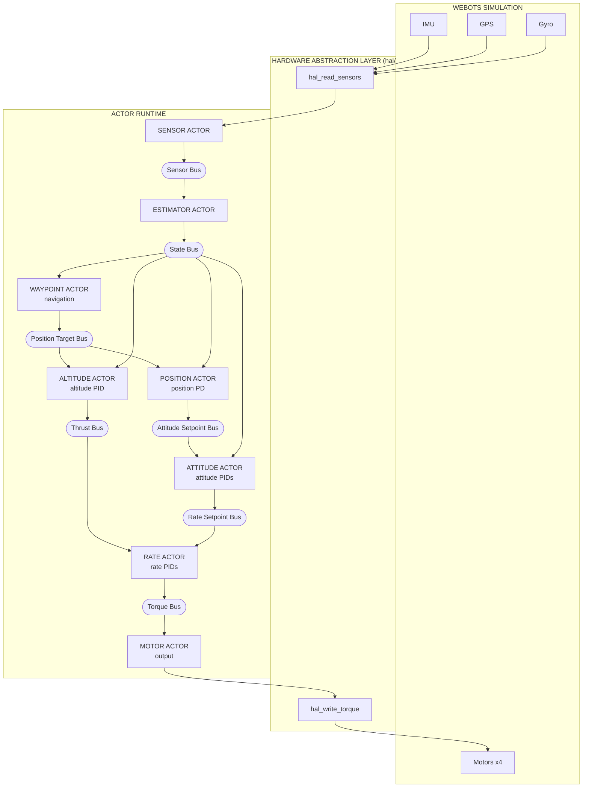
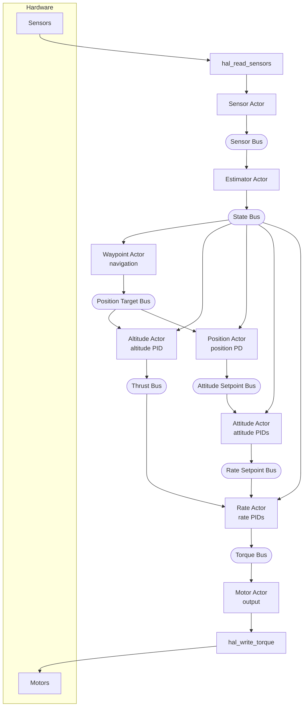
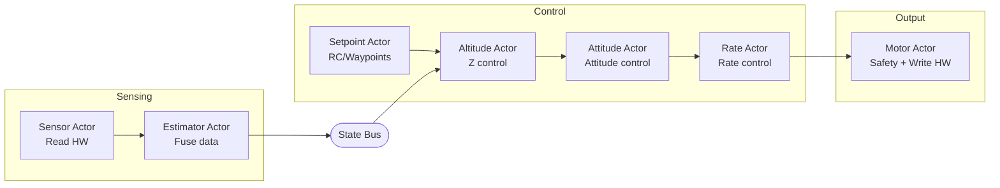

# Pilot Example Specification

A quadcopter autopilot example using the actor runtime. Supports Webots simulation
(default) and STM32 hardware (Crazyflie 2.1+, STEVAL-DRONE01).

## Status

**Implemented:**
- Altitude-hold hover with attitude stabilization
- Horizontal position hold (GPS-based XY control)
- Heading hold (yaw control with angle wrap-around)
- Waypoint navigation (square demo route with altitude and heading changes)
- Step 1: Motor actor (safety, watchdog)
- Step 2: Separate altitude actor (altitude/rate split)
- Step 3: Sensor actor (hardware abstraction)
- Step 4: Attitude actor (attitude angle control)
- Step 5: Estimator actor (sensor fusion, vertical velocity)
- Step 6: Position actor (horizontal position hold + heading hold)
- Step 7: Waypoint actor (waypoint navigation)
- Step 8: Flight manager actor (startup coordination, safety cutoff)
- Mixer moved to HAL (platform-specific, X-configuration)

## Goals

1. **Showcase the actor runtime** - demonstrate benefits of actor-based design for embedded systems
2. **Improve the runtime** - if problems arise (latency, scheduling), fix the runtime, don't work around it
3. **Beautiful code** - show how an autopilot can be elegantly written using actors
4. **Hover control** - maintain stable altitude and attitude
5. **Clean architecture** - portable actor code with HAL abstraction
6. **Webots integration** - use `hive_advance_time()` + `hive_run_until_blocked()` per simulation step

The pilot serves dual purposes: a real-world stress test that exposes runtime weaknesses, and a showcase of clean actor-based embedded design.

## Design Decisions

### Why buses instead of IPC?

- **Buses** provide latest-value semantics - subscribers get current state, not history
- **IPC notify** queues every message - slow consumers would process stale data
- For control loops, you always want the *latest* sensor reading, not a backlog

### Why max_entries=1?

All buses use `max_entries=1` (single entry, latest value only):

```c
#define HAL_BUS_CONFIG { \
    .max_subscribers = 6, \
    .max_entries = 1, \      // Latest value only
    .max_entry_size = 128 \
}
```

- Control loops need current state, not history
- If a subscriber is slow, it should skip stale data, not queue it
- Larger buffers would cause processing of outdated sensor readings
- This matches how real flight controllers handle sensor data

### Startup Ordering

Actors must be spawned in dependency order for correct initialization:

1. **Sensor → Estimator** - Estimator subscribes to sensor bus
2. **Controllers** - Subscribe to state bus (created by estimator)
3. **Motor** - Subscribes to torque bus (created by rate actor)
4. **Flight manager** - Needs actor IDs for IPC notifications

**Important:** Bus subscriptions see nothing until first publish *after* subscription.
A subscriber spawned before the first publish will get valid data on first read.
A subscriber spawned *after* a publish sees nothing until the next publish.

The current spawn order in `pilot.c` ensures all subscribers are ready before
their data sources begin publishing. If spawn order is changed, verify that
subscribers don't miss initial data.

### Pipeline Model

The control system is a pipeline, not a synchronous snapshot. Each actor processes
the most recent data available when it runs, not a coordinated snapshot from the
same instant.

**Timing characteristics (250 Hz, 4ms tick):**
- Sensor reads hardware, publishes to sensor bus
- Estimator processes sensor data, publishes state estimate
- Controllers cascade: altitude → position → attitude → rate
- Motor receives torque commands, outputs to hardware

**Worst-case latency:** One tick (4ms) from sensor read to motor output. This occurs
when sensor publishes just after motor finishes reading, requiring a full tick before
motor sees the new data.

**Why this is acceptable:**
- This pipelined approach is standard practice in flight controllers (PX4, ArduPilot)
- At 250 Hz, one tick of latency is 4ms—well within control loop requirements
- Synchronous snapshotting would add complexity with minimal benefit
- Controllers use rate damping terms that compensate for small latencies

## Non-Goals (Future Work)

- Full state estimation (Kalman filter)
- Failsafe handling
- Parameter tuning UI
- Multiple vehicle types

## Limitations (Production Requirements)

**This example is a demonstration, not production-ready flight software.**

A production flight controller would need error handling and failsafes that this example omits:

### Missing Error Handling

| Scenario | Current Behavior | Production Requirement |
|----------|------------------|------------------------|
| Sensor read fails | `hive_bus_read()` returns error, actor skips iteration | Watchdog timeout, switch to backup sensor or land |
| Bus publish fails | Error ignored | Log error, trigger failsafe |
| Actor crashes | Runtime notifies linked actors | Auto-restart or emergency landing |
| GPS signal lost | Position control uses stale data | Hold last position, descend slowly, or return-to-home |
| IMU data invalid | Garbage in, garbage out | Sanity checks, sensor voting, reject outliers |

### Implemented Safety Features (STM32 only)

The following safety features are enabled for real hardware (not in Webots simulation):

| Feature | Location | Behavior |
|---------|----------|----------|
| Attitude cutoff | altitude_actor.c | Motors off if roll or pitch >45° |
| Altitude cutoff | altitude_actor.c | Motors off if altitude >2m |
| Landed detection | altitude_actor.c | Motors off when target <5cm and altitude <15cm |
| Thrust ramp | altitude_actor.c | Gradual thrust increase over 0.5 seconds on takeoff |
| Startup delay | flight_manager_actor.c | Flight blocked for 60 seconds after boot |
| Hard cutoff | flight_manager_actor.c | Motors forced off 12 seconds after flight starts |

### Future Safety Features

The following may be added after initial flight testing:

- **Rate cutoff**: Motors off if angular rate exceeds threshold (e.g., >300°/s) - catches violent oscillation while within tilt limits
- **Accelerometer sanity check**: Motors off if acceleration readings are implausible
- **Sensor timeout**: Motors off if no sensor updates within expected interval

### Missing Safety Features (Production Requirements)

- **Geofence**: No boundary limits - drone can fly away indefinitely
- **Battery monitoring**: No low-voltage warning or auto-land
- **Arming/disarming**: No safety switch to prevent accidental motor start
- **Pre-flight checks**: No sensor validation before takeoff
- **Communication loss**: No failsafe if telemetry link drops

### Why These Are Omitted

This example focuses on demonstrating the actor runtime architecture, not building a safe drone. Adding proper failsafes would obscure the core concepts (actors, buses, control loops) with error handling code.

For a production system, each actor should:
1. Validate inputs before processing
2. Handle bus read/write failures
3. Implement timeouts for expected data
4. Report health status to a flight manager actor
5. Respond to emergency stop commands

### Production Instrumentation Requirements

The following instrumentation should be added for production flight software:

**Error Counters (per actor):**
- `bus_read_fail_count` - incremented when `hive_bus_read()` returns error
- `bus_publish_fail_count` - incremented when `hive_bus_publish()` returns error
- Counters exposed via telemetry or debug interface

**Motor Deadman Watchdog:**
- Production motor actor requires a torque watchdog
- If no valid torque command received within 3 ticks (12ms), zero all motors
- Protects against controller actor crash leaving motors at last commanded value
- This example omits the watchdog to keep motor actor minimal

These requirements are documented here but not implemented in the example to
maintain code clarity. A production system would add these as first priorities.

---

## Architecture Overview

Nine actors connected via buses:



---

## Implementation Details

### Multi-File Design

Code is split into focused modules:

| File | Purpose |
|------|---------|
| `pilot.c` | Main loop, bus setup, actor spawn |
| `sensor_actor.c/h` | Reads sensors via HAL, publishes to sensor bus |
| `estimator_actor.c/h` | Sensor fusion → state bus |
| `altitude_actor.c/h` | Altitude PID → thrust |
| `waypoint_actor.c/h` | Waypoint navigation → position target bus |
| `position_actor.c/h` | Position PD → attitude setpoints |
| `attitude_actor.c/h` | Attitude PIDs → rate setpoints |
| `rate_actor.c/h` | Rate PIDs → torque commands |
| `motor_actor.c/h` | Output: torque → HAL → motors |
| `flight_manager_actor.c/h` | Startup delay, flight window cutoff |
| `pid.c/h` | Reusable PID controller |
| `types.h` | Portable data types |
| `config.h` | Configuration constants (timing, thresholds) |
| `math_utils.h` | Math macros (CLAMPF, LPF, NORMALIZE_ANGLE) |
| `notifications.h` | IPC notification tags (NOTIFY_FLIGHT_START, etc.) |
| `flight_profiles.h` | Waypoint definitions per flight profile |

### Data Flow



---

## Control Algorithms

### PID Controller

Standard discrete PID with anti-windup:

```c
float pid_update(pid_state_t *pid, float setpoint, float measurement, float dt) {
    float error = setpoint - measurement;

    float p = pid->kp * error;

    pid->integral += error * dt;
    pid->integral = clamp(pid->integral, -integral_max, integral_max);
    float i = pid->ki * pid->integral;

    float d = pid->kd * (error - pid->prev_error) / dt;
    pid->prev_error = error;

    return clamp(p + i + d, -output_max, output_max);
}
```

### Tuned PID Gains

PID gains are platform-specific, defined in each `hal/<platform>/hal_config.h`.
The control cascade uses:

- **Altitude:** PI + velocity damping (Kv) for smooth response
- **Position:** PD with velocity damping, max tilt limited
- **Attitude:** P controller for roll/pitch/yaw angles
- **Rate:** PD controller for angular rates

### Mixer

Each HAL implements its own X-configuration mixer in `hal_write_torque()`.
See `hal/<platform>/README.md` for motor layout and mixing equations.

---

## Main Loop

The main loop is minimal - all logic lives in actors:

```c
// Simulation (Webots)
while (hal_step()) {
    hive_advance_time(HAL_TIME_STEP_US);
    hive_run_until_blocked();
}

// Real-time (STM32)
hive_run();
```

Control rate is 250 Hz (4ms time step). Each step triggers the control chain:
sensor → estimator → altitude/waypoint/position → attitude → rate → motor.

---

## Portability

### Hardware Abstraction Layer (HAL)

All hardware access goes through `hal/hal.h`. Each platform provides its own
implementation of this interface:

```c
// Platform lifecycle
int hal_init(void);        // Initialize hardware
void hal_cleanup(void);    // Release resources
void hal_calibrate(void);  // Calibrate sensors
void hal_arm(void);        // Enable motor output
void hal_disarm(void);     // Disable motor output

// Sensor interface (called by sensor_actor)
void hal_read_sensors(sensor_data_t *sensors);

// Motor interface (called by motor_actor)
void hal_write_torque(const torque_cmd_t *cmd);

// Simulation time (only for SIMULATED_TIME builds)
bool hal_step(void);  // Advance simulation, returns false when done
```

Actors use the HAL directly - no function pointers needed:
- `sensor_actor.c` calls `hal_read_sensors()`
- `motor_actor.c` calls `hal_write_torque()`

### Supported Platforms

| Platform | Build | Details |
|----------|-------|---------|
| Webots simulation | `make` | Uses `-DSIMULATED_TIME` |
| Crazyflie 2.1+ | `make -f Makefile.crazyflie-2.1+` | See `hal/crazyflie-2.1+/README.md` |
| STEVAL-DRONE01 | `make -f Makefile.STEVAL-DRONE01` | See `hal/STEVAL-DRONE01/README.md` |

All hardware differences are encapsulated in the HAL. Actor code is identical
across platforms. The only compile-time difference is `SIMULATED_TIME` which
controls the main loop (simulation vs real-time).

### Portable Code

All actor code is platform-independent. Actors use:
- Bus API for inter-actor communication
- HAL API for hardware access (abstracted)

| File | Dependencies |
|------|--------------|
| `sensor_actor.c/h` | HAL (hal_read_sensors) + bus API |
| `estimator_actor.c/h` | Bus API only |
| `altitude_actor.c/h` | Bus API only |
| `waypoint_actor.c/h` | IPC + bus API |
| `position_actor.c/h` | Bus API only |
| `attitude_actor.c/h` | Bus API only |
| `rate_actor.c/h` | Bus API only |
| `motor_actor.c/h` | HAL (hal_write_torque) + IPC + bus API |
| `flight_manager_actor.c/h` | IPC only (no bus) |
| `pid.c/h` | Pure C, no runtime deps |
| `types.h` | Data structures |
| `config.h` | Tuning parameters |

---

## File Structure

```
examples/pilot/
    pilot.c              # Main loop, bus setup, actor spawn
    sensor_actor.c/h     # Reads sensors via HAL → sensor bus
    estimator_actor.c/h  # Sensor fusion → state bus
    altitude_actor.c/h   # Altitude PID → thrust
    waypoint_actor.c/h   # Waypoint navigation → position target bus
    position_actor.c/h   # Position PD → attitude setpoints
    attitude_actor.c/h   # Attitude PIDs → rate setpoints
    rate_actor.c/h       # Rate PIDs → torque commands
    motor_actor.c/h      # Output: torque → HAL → motors
    flight_manager_actor.c/h # Startup delay, flight window cutoff
    pid.c/h              # Reusable PID controller
    types.h              # Portable data types
    config.h             # Configuration constants
    math_utils.h         # Math macros
    notifications.h      # IPC notification tags
    flight_profiles.h    # Waypoint definitions
    fusion/
        complementary_filter.c/h  # Portable attitude estimation
    Makefile                 # Webots simulation build
    Makefile.crazyflie-2.1+  # Crazyflie 2.1+ build
    Makefile.STEVAL-DRONE01  # STEVAL-DRONE01 build
    hive_config.mk           # Shared Hive memory config
    SPEC.md              # This specification
    README.md            # Usage instructions
    worlds/
        hover_test.wbt   # Webots world file
    controllers/
        pilot/           # Webots controller (installed here)
    hal/
        hal.h                # Common HAL interface
        webots-crazyflie/    # Webots simulation HAL
        crazyflie-2.1+/      # Crazyflie 2.1+ HAL (STM32F405)
        STEVAL-DRONE01/      # STEVAL-DRONE01 HAL (STM32F401)
```

---

## Testing Results

### Hover Behavior

1. Drone starts at 0.5m altitude (world file setting)
2. Altitude PID commands increased thrust
3. Drone rises with some initial oscillation
4. Settles at 1.0m within ~3 seconds
5. Maintains stable hover at 1.0m ± 0.05m

### Console Output

```
9 actors spawned
[ALT] tgt=1.00 alt=0.01 vvel=0.00 thrust=0.750
[ALT] tgt=1.00 alt=0.05 vvel=0.12 thrust=0.720
...
[WPT] Advancing to waypoint 1: (1.0, 0.0, 1.2) yaw=0 deg
[ALT] tgt=1.20 alt=1.02 vvel=0.05 thrust=0.560
[POS] tgt=(1.0,0.0) x=0.12 y=0.00 pitch=5.2 roll=0.0
...
```

---

## Architecture Evolution Roadmap

The example will evolve incrementally toward a clean multi-actor design.
Each step maintains a working system while improving separation of concerns.

### Target Architecture



### Actor Responsibilities (Current)

| Actor | Input | Output | Priority | Responsibility |
|-------|-------|--------|----------|----------------|
| **Sensor** | Hardware | Sensor Bus | CRITICAL | Read raw sensors, publish |
| **Estimator** | Sensor Bus | State Bus | CRITICAL | Complementary filter fusion, state estimate |
| **Flight Manager** | (none) | START/STOP notifications | CRITICAL | Startup delay, flight window cutoff |
| **Waypoint** | State Bus + START notification | Position Target Bus | CRITICAL | Waypoint navigation (3D on Webots, altitude-only on STM32) |
| **Altitude** | State + Position Target Bus | Thrust Bus | CRITICAL | Altitude PID (250Hz) |
| **Position** | Position Target + State Bus | Attitude Setpoint Bus | CRITICAL | Position PD (250Hz) |
| **Attitude** | Attitude Setpoint + State | Rate Setpoint Bus | CRITICAL | Attitude PIDs (250Hz) |
| **Rate** | State + Thrust + Rate SP | Torque Bus | CRITICAL | Rate PIDs (250Hz) |
| **Motor** | Torque Bus + STOP notification | Hardware | CRITICAL | Output to hardware via HAL |

**Why all CRITICAL?** All actors use the same priority so execution order follows spawn order
(round-robin within priority level). This ensures the data pipeline executes correctly:
sensor → estimator → waypoint → altitude → position → attitude → rate → motor.
Differentiated priorities would break this—higher priority actors run first regardless of
spawn order, causing motor to output before controllers have computed new values.

### Step 1: Motor Actor ✓

Separate motor output into dedicated actor.

```
Rate Actor ──► Torque Bus ──► Motor Actor ──► HAL ──► Hardware
                               (output)         (mixer)
```

**Features:** Subscribe to torque bus, call HAL for motor output. Mixer is in HAL.

### Step 2: Separate Altitude Actor ✓

Split altitude control from rate control.

```
Sensor Bus ──► Altitude Actor ──► Thrust Bus ──► Rate Actor ──► Torque Bus
            (altitude PID)                    (rate PIDs only)
```

**Benefits:** Clear separation, different rates possible, easier tuning.

### Step 3: Sensor Actor ✓

Move sensor reading from main loop into actor.

```
Main Loop: hal_step() + hive_advance_time() + hive_run_until_blocked()
Sensor Actor: timer ──► hal_read_sensors() ──► Sensor Bus
```

**Benefits:** Main loop is minimal, all logic in timer-driven actors.

### Step 4: Attitude Actor ✓

Add attitude angle control between altitude and rate control.

**Before:**
```
Sensor Bus ──► Rate Actor (rate PIDs with hardcoded 0.0 setpoints)
```

**After:**
```
Sensor Bus ──► Attitude Actor ──► Rate Setpoint Bus ──► Rate Actor
            (attitude PIDs)                          (rate PIDs)
```

**Benefits:**
- Cascaded control (proper drone architecture)
- Attitude controller generates rate setpoints
- Rate controller tracks those setpoints
- Easier to tune each layer independently

### Step 5: Estimator Actor ✓

Add sensor fusion between raw sensors and controllers.

**Before:**
```
Sensor Actor ──► Sensor Bus ──► Controllers
```

**After:**
```
Sensor Actor ──► Sensor Bus ──► Estimator Actor ──► State Bus ──► Controllers
                             (complementary filter)
```

**Implementation:**
- Runs portable complementary filter (`fusion/complementary_filter.c`)
- Fuses accelerometer and gyroscope for roll/pitch estimation
- Fuses magnetometer for yaw (when available)
- Computes velocities by differentiating position with low-pass filter
- Webots: synthesizes accelerometer from gravity + inertial_unit angles

**Benefits:**
- Controllers use state estimate, not raw sensors
- Derived values (velocities) computed in one place
- Fusion algorithm is portable (same code on all platforms)
- HALs are simpler (just raw sensor reads)

### Step 6: Position Actor ✓

Add horizontal position hold and heading hold.

**Before:**
```
Attitude Actor uses hardcoded 0.0 attitude setpoints
```

**After:**
```
State Bus ──► Position Actor ──► Attitude Setpoint Bus ──► Attitude Actor
              (position PD)       (roll, pitch, yaw)    (attitude PIDs)
```

**Implementation:**
- Simple PD controller: position error → attitude command
- Velocity damping: reduces overshoot
- Max tilt limit: 0.35 rad (~20°) for safety
- Sign conventions match Bitcraze Webots controller
- Heading hold: publishes target yaw from waypoint actor
- Angle wrap-around: `pid_update_angle()` handles ±π discontinuity
- World-to-body frame transformation based on current yaw

**Benefits:**
- Drone holds XY position and heading
- Returns to target when displaced or rotated
- Takes shortest rotation path (never rotates >180°)

### Step 7: Waypoint Actor ✓

Add waypoint navigation with platform-specific routes.

**Before:**
```
Altitude Actor uses hardcoded TARGET_ALTITUDE
Position Actor uses hardcoded TARGET_X, TARGET_Y, TARGET_YAW
```

**After:**
```
                              ┌──► Altitude Actor (reads z)
State Bus ──► Waypoint Actor ──► Position Target Bus
              (navigation)       (x, y, z, yaw)
                              └──► Position Actor (reads x, y, yaw)
```

**Implementation:**
- Manages list of waypoints (platform-specific)
- Publishes current target to position target bus
- Altitude actor reads target altitude from position target bus
- Position actor reads target XY and yaw from position target bus
- Monitors state bus for arrival detection
- Arrival requires: altitude, heading within tolerance, velocity below threshold
- Hovers briefly at each waypoint before advancing
- Loops forever: returns to first waypoint after completing route

**Platform-specific routes:**
- **Webots:** 3D waypoints with square pattern and altitude changes
- **STM32 hardware:** Platform-dependent (see flight profiles in README.md)
- **First flight test:** Hover at 0.5m briefly, then land (safe tethered test)

**Benefits:**
- Decouples waypoint logic from both position and altitude control
- Both actors read targets from bus (no hardcoded values)
- World-to-body frame transformation handles arbitrary headings
- Easy to extend with mission planning

### Step 8: Flight Manager Actor ✓

Add centralized startup coordination and safety cutoff.

**Before:**
```
Startup delay and flight window in motor_actor
Waypoint actor starts immediately
```

**After:**
```
Flight Manager Actor ──► START notification ──► Waypoint Actor
                                              │
                                              ↓ (flight begins)
                 ──► STOP notification ──► Motor Actor
                      (after flight window)    │
                                               ↓ (motors zeroed)
```

**Implementation:**
- Handles 60-second startup delay (hardware only)
- Sends START notification to waypoint actor to begin flight
- Enforces 12-second flight window (hardware only)
- Sends STOP notification to motor actor after flight window expires
- Motor actor zeros torque output when stopped

**Benefits:**
- Centralized safety timing (not scattered across actors)
- Clear flight authorization flow
- Waypoint actor blocks until flight manager authorizes flight
- Easy to add pre-flight checks in one place

### Step 9 (Future): RC Input / Mode Switching

**Future extensions:**
- RC input handling (manual override)
- Takeoff/landing sequences
- Mode switching (hover, land, follow-me, etc.)
- Dynamic waypoint updates via telemetry

---

## Memory Requirements

### STM32 Builds

| Platform | Flash | RAM | MCU |
|----------|-------|-----|-----|
| Crazyflie 2.1+ | ~39 KB | ~140 KB | STM32F405 (1 MB / 192 KB) |
| STEVAL-DRONE01 | ~60 KB | ~57 KB | STM32F401 (256 KB / 64 KB) |

### Configuration Split

Hive memory settings are split between shared and platform-specific files:

| File | Contents |
|------|----------|
| `hive_config.mk` | Shared settings: actors, buses, pools, message size |
| `Makefile.<platform>` | Platform-specific: stack sizes, flash layout |

The shared settings in `hive_config.mk` are determined by the pilot application
(9 actors, 7 buses, etc.) and are identical across all platforms. Only stack
sizes vary based on available RAM.

---

## Future Extensions

1. **Mission planning** - Load waypoints from file, complex routes
2. **Sensor fusion** - Complementary filter for better attitude estimation
3. **Failsafe** - Motor failure detection, emergency landing
4. **Telemetry** - Logging, MAVLink output
5. **RC input** - Manual control override
6. **Setpoint actor** - Altitude command generation, mode switching
